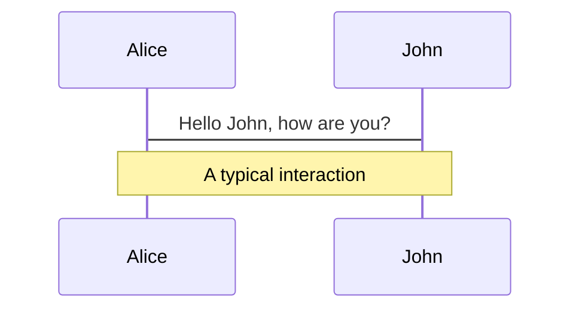
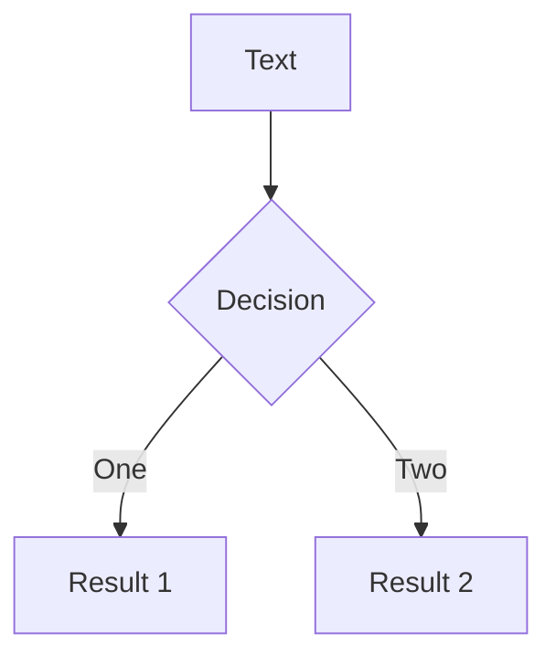

# On Performance Stability in LSM-based Storage Systems

<div class="text-gray-400">Check the website <a href="https://ahacad.github.io/LSM-pre">https://ahacad.github.io/LSM-pre</a> for online slides.</div>

<a href="https://ahacad.github.io/LSM-pre" target="_blank" alt="GitHub"
  class="abs-br m-6 text-xl icon-btn opacity-50 !border-none !hover:text-white">
  <carbon-logo-github />
</a>
---

# A look ahead

<

---

# Table of contents
<div class="mt-8"/>

<TOC />
---

# Roadmap
<div class="mt-8"/>

<TOC count="1"/>
---

# LSM (Log-Structured Merge-Tree) - 1


<div class="grid grid-cols-2">
<figure>

<figcaption class="pl-20 text-xs">Fig. 1</figcaption>
</figure>
<figure>

<figcaption class="pl-30 text-xs">Fig. 2</figcaption>
</figure>
</div>

- unlike B+ tree (in-place update) which overwrites old entries, we store updates into new locations <span class="text-gray-400">(Fig. 1)</span>
- only append operations (insert OR update), delete = anti-matter entry, like writing everything into a "log"

- **buffers** all writes in memory ($C_0$), and **flushes** them to disk and **merges** later<span class="text-gray-400">(Fig. 2)</span>

- quick write (due to sequential I/Os), but slow read
---

# LSM (Log-Structured Merge-Tree) - 2

<div class="mt-12"/>
<div class="grid grid-cols-2">
<div>

  - today's LSM-tree use <span class="font-bold">merging</span> to reduce components examined when querying
  - two merging policies: leveling merge policy & tiering merge policy
  - <span class="font-bold">leveling</span>: 1 component, merged with Level $i-1$ until big enough and then merged into Level $i+1$
  - <span class="font-bold">tiering</span>: T components at Level $i$, then merged together to Level $i+1$

</div>

<figure class="m-auto">

<figcaption class="pl-34 text-xs">Fig. 1</figcaption>
</figure>

</div>
---

# LSM (Log-Structured Merge-Tree) - 3

<div class="mt-12"/>

<figure class="m-auto">

<figcaption class="pl-8 text-xs">Partitioned LSM-tree, Leveling Merge Policy</figcaption>
</figure>

<div class="mt-4"/>

- **Partitioning**: large LSM disk component range-partitioned into multiple files for **optimization**

- **Write Stalls**: memory speed faster than I/Os, writing to memory will be **stalled** (the *write stall* problem)

- **merges** are major cause of stalls, since components are merged multiple times, but writes only flush once

---

# LSM (Log-Structured Merge-Tree) - Quick recap

<div>

$a+b=c$

- findout $\sum 3$


</div>


---

# Setups and measuring models


--- 


# Conclusions

- the two-phase approach to evaluate the impact of write stalls
- design choices for LSM merge schedulers: full-merges and partitioned merges
- consider **performance variance** and **write throughput** together
---

# References

- [1]C. Luo and M. J. Carey, “On performance stability in LSM-based storage systems,” Proc. VLDB Endow., vol. 13, no. 4, pp. 449–462, Dec. 2019, doi: 10.14778/3372716.3372719.
- [1] C. Luo and M. J. Carey, “LSM-based Storage Techniques: A Survey,” The VLDB Journal, vol. 29, no. 1, pp. 393–418, Jan. 2020, doi: 10.1007/s00778-019-00555-y.
- [1] P. O’Neil, E. Cheng, D. Gawlick, and E. O’Neil, “The log-structured merge-tree (LSM-tree),” Acta Informatica, vol. 33, no. 4, pp. 351–385, Jun. 1996, doi: 10.1007/s002360050048.

- [1] P. Guo, “Log Structured Merge Tree.” [Online]. Available: https://lrita.github.io/images/posts/database/lsmtree-170129180333.pdf
- [1] “The Log-Structured Merge-Tree (LSM Tree) | the morning paper.” https://blog.acolyer.org/2014/11/26/the-log-structured-merge-tree-lsm-tree/ (accessed May 30, 2021).

---

# What is Slidev?

Slidev is a slides maker and presenter designed for developers, consist of the following features

- 📝 **Text-based** - focus on the content with Markdown, and then style them later
- 🎨 **Themable** - theme can be shared and used with npm packages
- 🧑‍💻 **Developer Friendly** - code highlighting, live coding with autocompletion
- 🤹 **Interactive** - embedding Vue components to enhance your expressions
- 🎥 **Recording** - built-in recording and camera view
- 📤 **Portable** - export into PDF, PNGs, or even a hostable SPA
- 🛠 **Hackable** - anything possible on a webpage

<br>
<br>

Read more about [Why Slidev?](https://sli.dev/guide/why)

<!--
You can have `style` tag in markdown to override the style for the current page.
Learn more: https://sli.dev/guide/syntax#embedded-styles
-->

<style>
h1 {
  background-color: #2B90B6;
  background-image: linear-gradient(45deg, #4EC5D4 10%, #146b8c 20%);
  background-size: 100%;
  -webkit-background-clip: text;
  -moz-background-clip: text;
  -webkit-text-fill-color: transparent; 
  -moz-text-fill-color: transparent;
}
</style>

---

# Navigation

Hover on the bottom-left corner to see the navigation's controls panel, [learn more](https://sli.dev/guide/navigation.html)

### Keyboard Shortcuts

|     |     |
| --- | --- |
| <kbd>right</kbd> / <kbd>space</kbd>| next animation or slide |
| <kbd>left</kbd> | previous animation or slide |
| <kbd>up</kbd> | previous slide |
| <kbd>down</kbd> | next slide |

<!-- https://sli.dev/guide/animations.html#click-animations -->

<p v-after class="absolute bottom-23 left-45 opacity-30 transform -rotate-10">Here!</p>

---
layout: image-right
image: https://source.unsplash.com/collection/94734566/1920x1080
---

# Code

Use code snippets and get the highlighting directly!

<!-- https://sli.dev/guide/syntax.html#line-highlighting -->

```ts {all|2|1-6|9|all}
interface User {
  id: number
  firstName: string
  lastName: string
  role: string
}

function updateUser(id: number, update: User) {
  const user = getUser(id)
  const newUser = {...user, ...update}  
  saveUser(id, newUser)
}
```

<arrow v-click="3" x1="400" y1="420" x2="230" y2="330" color="#564" width="3" arrowSize="1" />

---

# Components

<div grid="~ cols-2 gap-4">
<div>

You can use Vue components directly inside your slides.

We have provided a few built-in components like `<Tweet/>` and `<Youtube/>` that you can use directly. And adding your custom components is also super easy.

```html
<Counter :count="10" />
```

<!-- ./components/Counter.vue -->
<Counter :count="10" m="t-4" />

Check out [the guides](https://sli.dev/builtin/components.html) for more.

</div>
<div>

```html
<Tweet id="1390115482657726468" />
```

<Tweet id="1390115482657726468" scale="0.65" />

</div>
</div>


---
class: px-20
---

# Themes

Slidev comes with powerful theming support. Themes are able to provide styles, layouts, components, or even configurations for tools. Switching between themes by just **one edit** in your frontmatter:

<div grid="~ cols-2 gap-2" m="-t-2">

```yaml
---
theme: default
---
```

```yaml
---
theme: seriph
---
```


</div>

Read more about [How to use a theme](https://sli.dev/themes/use.html) and
check out the [Awesome Themes Gallery](https://sli.dev/themes/gallery.html).

---
preload: false
---

# Animations

Animations are powered by [@vueuse/motion](https://motion.vueuse.org/).

```html
<div
  v-motion
  :initial="{ x: -80 }"
  :enter="{ x: 0 }">
  Slidev
</div>
```

<div class="w-60 relative mt-6">
  <div class="relative w-40 h-40">
    
    
    
  </div>

  <div 
    class="text-5xl absolute top-14 left-40 text-[#2B90B6] -z-1"
    v-motion
    :initial="{ x: -80, opacity: 0}"
    :enter="{ x: 0, opacity: 1, transition: { delay: 2000, duration: 1000 } }">
    Slidev
  </div>
</div>

<!-- vue script setup scripts can be directly used in markdown, and will only affects current page -->
<script setup lang="ts">
const final = {
  x: 0,
  y: 0,
  rotate: 0,
  scale: 1,
  transition: {
    type: 'spring',
    damping: 10,
    stiffness: 20,
    mass: 2
  }
}
</script>

<div
  v-motion
  :initial="{ x:35, y: 40, opacity: 0}"
  :enter="{ y: 0, opacity: 1, transition: { delay: 3500 } }">

[Learn More](https://sli.dev/guide/animations.html#motion)

</div>

---

# LaTeX

LaTeX is supported out-of-box powered by [KaTeX](https://katex.org/).

<br>

Inline $\sqrt{3x-1}+(1+x)^2$

Block
$$
\begin{array}{c}

\nabla \times \vec{\mathbf{B}} -\, \frac1c\, \frac{\partial\vec{\mathbf{E}}}{\partial t} &
= \frac{4\pi}{c}\vec{\mathbf{j}}    \nabla \cdot \vec{\mathbf{E}} & = 4 \pi \rho \\

\nabla \times \vec{\mathbf{E}}\, +\, \frac1c\, \frac{\partial\vec{\mathbf{B}}}{\partial t} & = \vec{\mathbf{0}} \\

\nabla \cdot \vec{\mathbf{B}} & = 0

\end{array}
$$

<br>

[Learn more](https://sli.dev/guide/syntax#latex)

---

# Diagrams

You can create diagrams / graphs from textual descriptions, directly in your Markdown.

<div class="grid grid-cols-2 gap-4 pt-4 -mb-6">





</div>

[Learn More](https://sli.dev/guide/syntax.html#diagrams)


---
layout: center
class: text-center
---

# Learn More

[Documentations](https://sli.dev) / [GitHub Repo](https://github.com/slidevjs/slidev)
